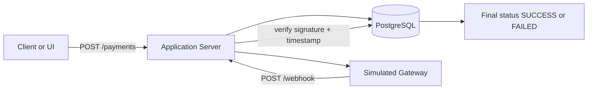

# Payment Simulation API

A practical Node.js + Express project that simulates how real-world systems integrate with payment providers.

This service allows you to:

- create payment transactions,
- mark them as `PENDING`,
- simulate asynchronous gateway callbacks,
- verify callback authenticity with HMAC signatures,
- and finalize transactions as `SUCCESS` or `FAILED`.

It is useful for learning and testing payment integration patterns such as webhook handling, signature validation, idempotency checks, and status transitions.

## Table of Contents

- [Overview](#overview)
- [Features](#features)
- [Tech Stack](#tech-stack)
- [Project Structure](#project-structure)
- [How It Works](#how-it-works)
- [Requirements](#requirements)
- [Getting Started](#getting-started)
- [Environment Variables](#environment-variables)
- [Database Setup](#database-setup)
- [API Reference](#api-reference)
- [Testing](#testing)
- [Security Notes](#security-notes)
- [Roadmap Ideas](#roadmap-ideas)
- [Author](#author)

## Overview

In many payment integrations, your application sends a payment request to a provider and later receives an asynchronous callback (webhook) with the final payment result.

This project reproduces that flow locally:

1. Client submits payment data.
2. Server creates a `PENDING` transaction.
3. A simulated gateway sends a delayed callback to `/webhook`.
4. Server verifies signature and timestamp.
5. Transaction is updated to `SUCCESS` or `FAILED`.

## Features

- REST endpoints for payment creation and webhook processing.
- EJS payment form for quick manual testing.
- PostgreSQL persistence for transactions.
- Simulated payment gateway callback with random delay and random final status.
- HMAC SHA-256 signature verification for webhook authenticity.
- Replay protection via callback age limit.
- Unit tests for key validation and webhook behavior.

## Tech Stack

- Node.js (CommonJS)
- Express 5
- PostgreSQL (`pg`)
- EJS
- Axios
- Node built-in test runner (`node:test`)

## Project Structure

```text
.
|-- config/
|   `-- database.js
|-- controllers/
|   |-- logics.js
|   `-- simulation.js
|-- routes/
|   `-- urls.js
|-- tests/
|   `-- logics.test.js
|-- views/
|   `-- home.ejs
|-- server.js
`-- package.json
```

## How It Works



## Requirements

- Node.js 18+ (recommended)
- PostgreSQL 13+ (recommended)

## Getting Started

1. Install dependencies:

   ```bash
   npm install
   ```

2. Configure environment variables in `.env` (see section below).

3. Create the database and transactions table.

4. Start the server:

   ```bash
   npm start
   ```

5. Open:

   - `http://localhost:3000/payments` for the form UI
   - or call the API directly

For development with auto-reload:

```bash
npm run dev
```

## Environment Variables

Create a `.env` file in the project root with:

```env
DB_USER=postgres
DB_HOST=localhost
DB_NAME=payments
DB_PORT=5432
DB_PASSWORD=your_password

PORT=3000

WEBHOOK_URL=http://localhost:3000/webhook
WEBHOOK_SECRET=replace_with_strong_secret
WEBHOOKMAXAGE=300000
```

Variable notes:

- `WEBHOOK_SECRET`: shared secret used to sign/verify callbacks.
- `WEBHOOKMAXAGE`: maximum acceptable callback age in milliseconds.

## Database Setup

Example PostgreSQL setup:

```sql
CREATE DATABASE payments;

\c payments;

CREATE TABLE IF NOT EXISTS transactions (
    id BIGSERIAL PRIMARY KEY,
    phone VARCHAR(20) NOT NULL,
    amount NUMERIC(12,2) NOT NULL CHECK (amount > 0),
    reference VARCHAR(64) UNIQUE NOT NULL,
    status VARCHAR(16) NOT NULL CHECK (status IN ('PENDING', 'SUCCESS', 'FAILED')),
    created_at TIMESTAMPTZ DEFAULT NOW(),
    updated_at TIMESTAMPTZ DEFAULT NOW()
);
```

Note: the application logic requires at least `phone`, `amount`, `reference`, and `status` columns in `transactions`.

## API Reference

Base URL: `http://localhost:3000`

### `GET /`

Health/welcome route.

Response:

```text
Welcome to the payment API
```

### `GET /payments`

Returns the EJS payment form page.

### `POST /payments`

Creates a transaction and triggers simulated callback flow.

Request body:

```json
{
  "phone": "0712345678",
  "amount": 2500
}
```

Validation rules:

- `phone` must be exactly 10 digits.
- `amount` must be numeric and greater than 0.

Success response (`201`):

```json
{
  "message": "Transaction created successfully",
  "transaction": {
    "phone": "0712345678",
    "amount": "2500.00",
    "reference": "ORD1713262000000",
    "status": "PENDING"
  }
}
```

### `POST /webhook`

Receives gateway callback and updates transaction state.

Request body:

```json
{
  "reference": "ORD1713262000000",
  "status": "SUCCESS",
  "timestamp": 1713262005000,
  "signature": "<hmac_sha256_hex>"
}
```

Signature formula used by simulator and verifier:

```text
HMAC_SHA256(secret, reference + status + timestamp + secret)
```

Possible responses:

- `200`: updated successfully
- `200`: already finalized (idempotent behavior)
- `400`: invalid input/signature/stale callback
- `404`: transaction not found

## Testing

Run tests:

```bash
npm test
```

Current automated tests cover:

- invalid phone rejection in payment creation,
- stale webhook callback rejection,
- rollback behavior when transaction is already finalized.

## Security Notes

- Webhook authenticity is enforced via HMAC signature verification.
- Replay attacks are reduced by timestamp freshness checks.
- Finalized transactions are protected from duplicate updates.
- Use a strong `WEBHOOK_SECRET` and never commit secrets to version control.

## Roadmap Ideas

- Add migration support (e.g., Knex/Prisma/Flyway).
- Add callback delivery retry and dead-letter logging.
- Add transaction query endpoint (`GET /payments/:reference`).
- Add structured logging and observability metrics.
- Add Docker and CI workflow.

## Author

Gwamaka A Mwakabuta
Mlue Technology
